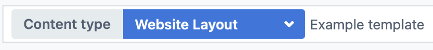

# Hack4Impact's Chapter Website Template 🚀

[](https://app.netlify.com/start/deploy?repository=https://github.com/hack4impact/chapter-website-template&utm_source=github&utm_medium=nextstarter-cs&utm_campaign=devex)

## Our tech stack

This template is built for generating a _static, super-efficient_ website that you can easily update overtime. For this, NextJS + Contentful formed the perfect dream team.

### NextJS ⚙️

[**NextJS**](https://nextjs.org/) is a great match for static sites, especially if you're already familiar with React. The main benefit is **flexibility:** you can build most of your site to _static,_ super-efficient HTML. Then, as your site expands, you can explore [server rendering and caching](https://medium.com/walmartglobaltech/the-benefits-of-server-side-rendering-over-client-side-rendering-5d07ff2cefe8) with almost zero extra setup. This opens to door for admin portals, nonprofit dashboards, and more!

### Contentful 📝

[**The Contentful CMS**](https://www.contentful.com/) is where all your text content and media (images and videos) are hosted. Above all, this services _eliminates_ the need to "ask the developer" whenever you want to add content to the site.

Have a new nonprofit project page to create? Need to update applications for the next recruitment cycle? Just edit some Google-Doc-style text boxes and hit "publish." If you're hosting your site on Netlify, you can [trigger your site to redeploy whenever](https://www.contentful.com/developers/docs/tutorials/general/automate-site-builds-with-webhooks/) new content is published!

## Set up Contentful

If you're unfamiliar with connecting NextJS and Contentful using GraphQL, read this article before proceeding 👇

[**NextJS, Contentful CMS, GraphQL, oh my!**](https://dev.to/hack4impact/nextjs-contentful-cms-graphql-oh-my-352o)

### Set your environment variables

To use Contentful in your project, you'll need to set some keys to talk to our Hack4Impact space.

Note that **we recommend using our existing Hack4Impact Contentful space.** Please contact us over slack or at contact@hack4impact.org for these credentials.

Once you have them, create a `.env` file in the base folder of this repo, and paste these contents:

```
# Token to log into our Contentful organization
NEXT_PUBLIC_CONTENTFUL_ACCESS_TOKEN=
# ID for the Hack4Impact website space
NEXT_PUBLIC_CONTENTFUL_SPACE_ID=
# ID for your Website Layout model
LAYOUT_ENTRY_ID=
```

### Create a new Website Layout entry

If you use our Hack4Impact space, you'll have a content model called **Website Layout** that you can access. This model outlines _all major_ pieces of your site, from your university logo to your nonprofit projects to your recruitment cycle information.

To create a new entry for your chapter's website:
1. Head to the **Content** tab and search for the "Example Template" to see how your end product might look 
3. Back out and create a new Website Layout entry from the **Add Entry** button. You can also **Duplicate** our template for a nice starting point, but _be warned!_ All referenced entries in this template (values, projects, etc) are _not_ duplicated. You'll need to detach these from your duplicated template, or you'll accidentally modify our example 😬
4. Fill out the contents as you wish. Feel free to omit non-required values where necessary, since this repo should be smart enough to handle optional content!
5. Copy your layout's **Entry ID** into your environment variables (`.env`) as the `LAYOUT_ENTRY_ID`. To find this, just head to the **Info** tab on your entry and copy the ID from there. 

## Building the site

Make sure you [have node installed](https://nodejs.org/en/) first. Then, pop open a terminal and run these commands in the project directory:

```
npm i
npm run dev
```

This will spin up a local server for you to preview your site. Note that the build _will_ fail if you haven't set your `.env` file! Head back to the "Set up Contentful" step for this.

💡 And no, **don't use `yarn` here.** That will create a second "lock" file that you won't want to push to the repository.

### Set up your editor

**[VS Code](https://code.visualstudio.com/) is our editor of choice at Hack4Impact.** This is why our repo comes with a `.vscode` directory, which will auto-configure some settings for this project (like auto-formatting code on save) and recommend some important extensions ([eslint](https://marketplace.visualstudio.com/items?itemName=dbaeumer.vscode-eslint) and [prettier](https://marketplace.visualstudio.com/items?itemName=esbenp.prettier-vscode)).

If you use an editor other than VS Code, don't fret! Just make sure you are using a prettier equivalent to format code while you work. All else fails, you can manually run these commands to fix formatting issues:

- **`npm run format`** - to fix any styling issues in your code (indentation and spacing, namely)
- **`npm run lint:fix`** - to fix any syntax concerns (like accessibility problems, bad HTML attributes, etc.)

### Building for production

If you use our template as-is, you'll probably want to "export" your site to a static set of HTML files. For this, just run the command:

```
npm run export
```

This will create a production-ready build of your site in the **`/out`** directory. This is the command you'll want to run for deployment as well.

## Deployment

We recommend deploying your site using [Netlify](https://www.netlify.com). It offers a whole host of benefits, like a generous free tier, automatic redeploys whenever your `main` branch updates, integrations for contact forms (if you implement them), etc.

Hit the button at the top of this repo to try it out! Just don't forget to [set the environment variables](https://docs.netlify.com/configure-builds/environment-variables/) to the contents of your `.env`. Your build command will be `npm run export`.

### Redeploy on Contentful changes

Netlify lets you set up "webhooks," which trigger redeploys on certain conditions. Just [read this guide](https://www.contentful.com/developers/docs/tutorials/general/automate-site-builds-with-webhooks/) to get set up! You should be able to use the webhook already configured in our Contentful space.